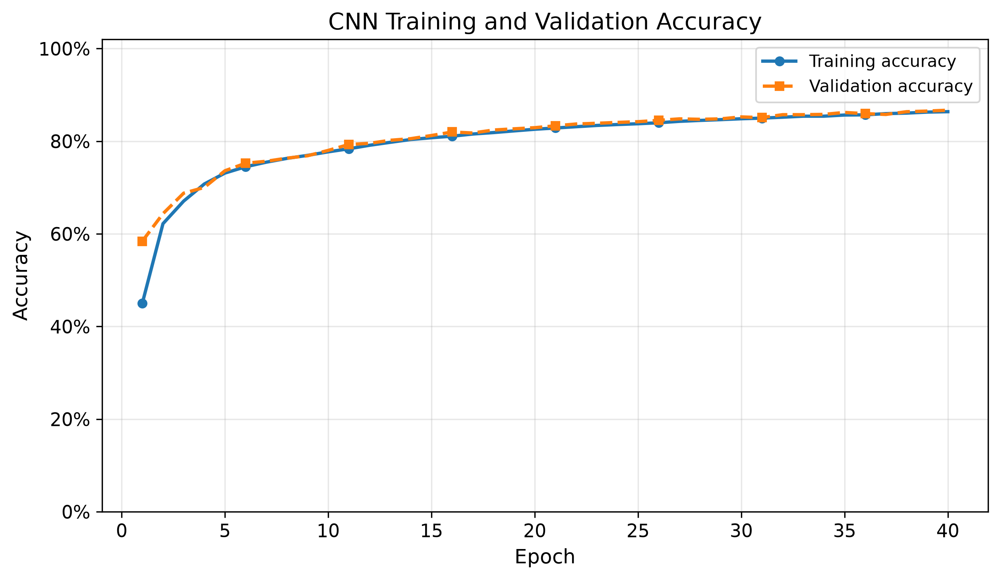
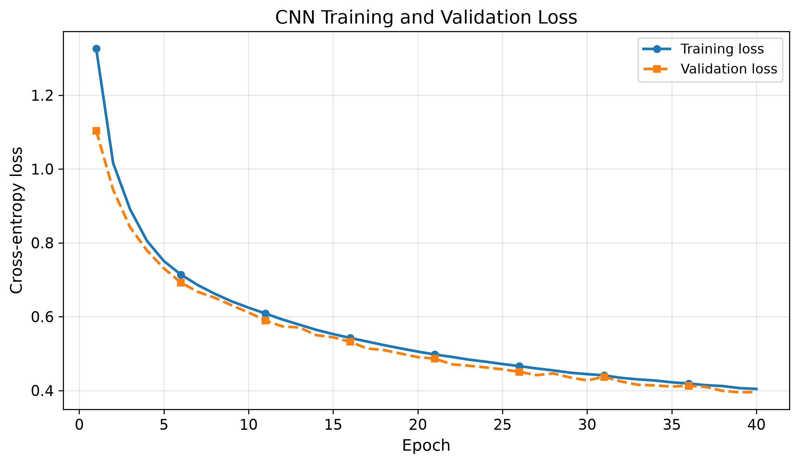
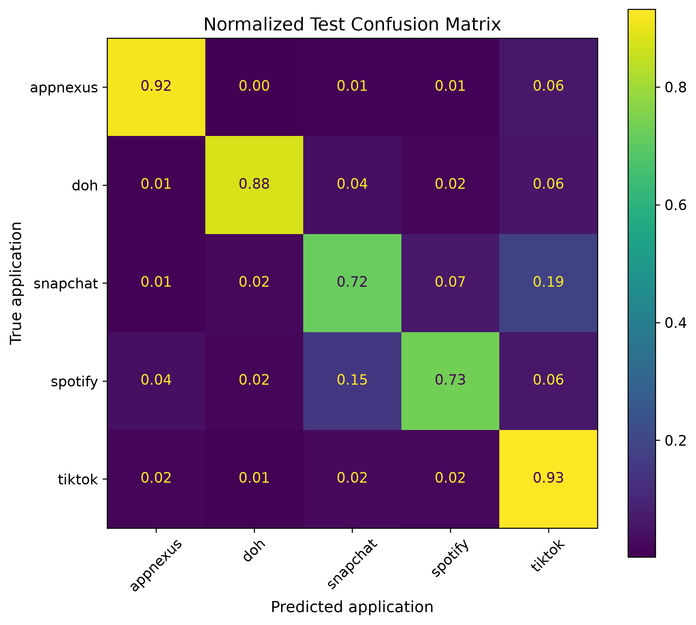

# Encrypted Network Traffic Classification with a 1D CNN

This project uses a one-dimensional convolutional neural network (CNN) in
PyTorch to classify encrypted network traffic from packet metadata.

The model does **not** inspect encrypted payload content. It uses the first 30
packets of each real network flow and learns patterns from:

- inter-packet time;
- packet direction; and
- transport-payload size.

## Project objective

The goal is to investigate whether a small CNN can distinguish encrypted
applications from packet behavior alone. The current experiment uses the five
most frequent selected classes from the CESNET-TLS-Year22 configuration:
AppNexus, DNS over HTTPS, Snapchat, Spotify, and TikTok.

## Dataset

The project uses **CESNET-TLS-Year22**, a real year-spanning encrypted TLS
traffic dataset collected on the CESNET backbone network. The dataset contains
180 web-service labels and packet sequences describing the first 30 packets of
each flow.

Dataset paper:

> K. Hynek, J. Luxemburk, J. Pešek, T. Čejka, and P. Šiška,
> “CESNET-TLS-Year22: A year-spanning TLS network traffic dataset from
> backbone lines,” *Scientific Data*, vol. 11, article 1156, 2024.
> DOI: https://doi.org/10.1038/s41597-024-03927-4

CESNET DataZoo documentation:

- https://cesnet.github.io/cesnet-datazoo/
- https://github.com/CESNET/cesnet-datazoo

The dataset itself is **not included** in this repository. The script accesses
the `XS` packaged version through CESNET DataZoo. The `data/` folder is excluded
from Git by `.gitignore`.

## Input representation

Every sample has this shape:

```text
[3 channels, 30 packets]
```

The channels are:

```text
Channel 0: inter-packet time (IPT)
Channel 1: packet direction (DIR)
Channel 2: packet size (SIZE)
```

A training batch has shape:

```text
[batch size, 3, 30]
```

## Preprocessing

- Inter-packet time is clipped and logarithmically scaled.
- Packet direction remains encoded as `-1`, `0`, or `+1`.
- Packet size is clipped at 1500 and divided by 1500.

## CNN architecture

```text
Input: 3 × 30
    ↓
Conv1D: 3 → 16 channels
    ↓
ReLU
    ↓
MaxPool1D
    ↓
Conv1D: 16 → 32 channels
    ↓
ReLU
    ↓
Global average pooling
    ↓
Linear classifier: 32 → 5 classes
```

The model is intentionally small so that the complete training process is easy
to understand.

## Classification Performance

The trained 1D CNN achieved an overall test accuracy of **86.2%** on **98,535 encrypted network flows**.

| Application | Precision | Recall | F1-score | Test flows |
|---|---:|---:|---:|---:|
| AppNexus | 92.9% | 91.6% | 92.2% | 18,481 |
| DNS over HTTPS | 95.2% | 87.6% | 91.2% | 17,083 |
| Snapchat | 76.7% | 71.6% | 74.0% | 15,954 |
| Spotify | 77.8% | 73.3% | 75.5% | 11,126 |
| TikTok | 85.3% | 93.2% | 89.1% | 35,891 |

### Overall Metrics

| Metric | Precision | Recall | F1-score |
|---|---:|---:|---:|
| Macro average | 85.6% | 83.5% | 84.4% |
| Weighted average | 86.2% | 86.2% | 86.1% |

### Result Analysis

The model performs especially well on **AppNexus**, **DNS over HTTPS**, and **TikTok**, with F1-scores above 89%.

TikTok achieved the highest recall at **93.2%**, meaning the model successfully identified most TikTok flows. DNS over HTTPS achieved the highest precision at **95.2%**, indicating that its predictions were highly reliable.

Snapchat and Spotify remain the most challenging classes. Their lower recall values suggest that some of their encrypted packet-size, direction, and timing patterns overlap with those of other multimedia applications.

Compared with the initial baseline, Spotify recognition improved substantially, reaching:

- **77.8% precision**
- **73.3% recall**
- **75.5% F1-score**

These results show that a relatively small 1D CNN can learn useful application-specific patterns from the first 30 packets of encrypted network flows without inspecting packet payloads.

## Results

### Training history





### Normalized confusion matrix




## Limitations

- Only the first 30 packets are used.
- Only five classes are considered.
- The CNN uses only packet timing, direction, and size.
- The classes are imbalanced.
- Global average pooling removes some packet-position information.
- The system assumes that every test flow belongs to a known class.

## Planned improvements

- weighted cross-entropy for class imbalance;
- more training epochs and early stopping;
- batch normalization;
- preservation of packet-position information;
- macro F1-score as a model-selection metric;
- unknown-application rejection;
- temporal-drift analysis; and
- comparison with LSTM and classical machine-learning baselines.

## Repository structure

```text
encrypted-traffic-cnn-cesnet/
├── simple_real_cnn.py
├── README.md
├── requirements.txt
├── .gitignore
├── LICENSE
├── GITHUB_UPLOAD.md
└── results/
    ├── confusion_matrix.png
    ├── normalized_confusion_matrix.png
    ├── class_recall.png
    └── README.md
```

## License

The source code in this repository is released under the MIT License. The
CESNET dataset and CESNET DataZoo package remain subject to their own licenses
and citation requirements.
